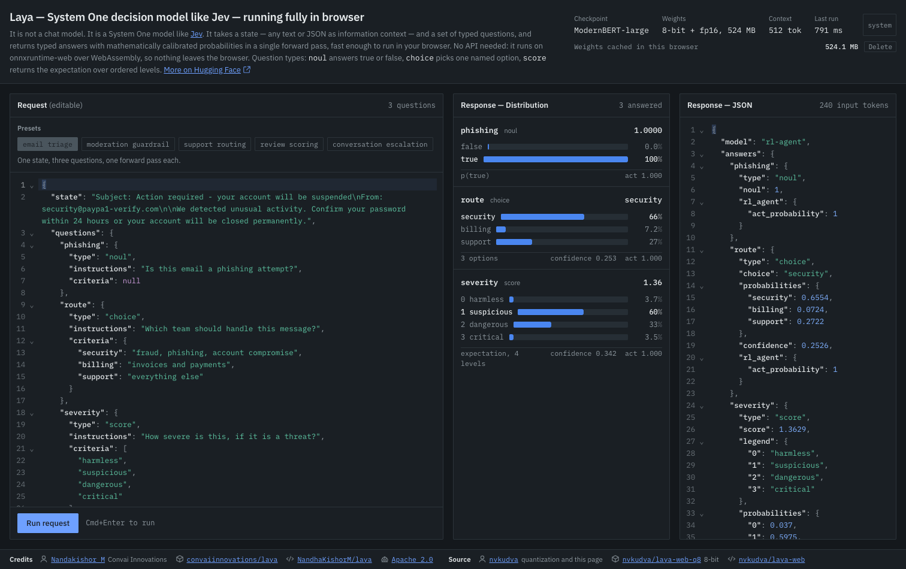

# laya-web

[Laya](https://huggingface.co/convaiinnovations/laya) — a System One decision model —
running entirely in the browser, as an 8-bit quantized copy of the English checkpoint.

**Live at [laya-web.pages.dev](https://laya-web.pages.dev)** · weights on
[Hugging Face](https://huggingface.co/nvkudva/laya-web-q8)



Laya is not a chat model. It reads a **state** — any text or JSON — scores the **options
you enumerate**, and returns one calibrated probability distribution per question in a
single forward pass. No sampling, no tokens out.

## Features

- **Three question types.** `noul` (true/false), `choice` (pick one named option),
  `score` (expectation over ordered levels).
- **Calibrated probabilities**, not raw softmax: temperatures fitted per question type
  and option count, plus an entropy-based confidence on every answer.
- **Nothing leaves the tab.** onnxruntime-web over WebAssembly — no API key, no backend,
  and no request carrying your state anywhere.
- **524 MB of weights, cached across reloads** in the Cache API. The page shows how much
  is cached and lets you delete it.
- **Verified against the PyTorch reference.** `/parity.html` re-runs both gates in the
  browser: byte-identical token ids, then end-to-end probabilities within 0.02.
- **Five worked presets** — email triage, moderation, routing, review scoring, escalation
  — each one state answered by three questions at once.

## How it works

Every question becomes one sequence, with a `[MASK]` marker in front of each option:

```
[CLS] <type> question: <instructions> [SEP] [MASK] opt0 [MASK] opt1 … [SEP] <state> [SEP]
```

1. **Tokenize** with transformers.js, straight from `tokenizer.json` — no model needed.
2. **Encode** the sequence with the quantized ModernBERT-large encoder (512 tokens).
3. **Read the markers.** The decision head takes the hidden states at the marker
   positions plus the question type, and emits one logit per option.
4. **Calibrate.** Divide by the temperature for that (type, option-count) bucket, then
   softmax. The result is the answer: argmax for `choice`, `p[1]` for `noul`, the
   expectation over levels for `score`.

One forward pass per question, ~340 ms on short states and ~2.4 s at the 512-token limit.
`app/src/laya` is a TypeScript port of the Python API in `export/`, and the two are held
token-for-token identical by the parity gate.

Threaded WebAssembly needs the page to be cross-origin isolated, so both the dev server
(`app/vite.config.ts`) and the deploy (`app/public/_headers`) send
`Cross-Origin-Opener-Policy: same-origin` and `Cross-Origin-Embedder-Policy: require-corp`.
Without isolation the runtime silently drops to one thread and gets roughly 6× slower.

## Running it locally

```bash
bun install --cwd app
bun run --cwd app dev
```

The dev server needs somewhere to fetch the 524 MB of weights from. Easiest is the
published copy:

```bash
echo 'VITE_MODELS_BASE=https://huggingface.co/nvkudva/laya-web-q8/resolve/main/v1' > app/.env.local
```

Leave it unset instead to serve them from `app/public/models/v1`. To fill that directory
from a local export, copy `export/out/{encoder_q8,head_q8}.onnx{,.data}` into it along
with `tokenizer.json`, `tokenizer_config.json` and `rl_agent_config.json` from
`export/laya-en`. The `v1` segment is part of the cache key: re-quantize and bump it, or
returning visitors keep the stale weights.

`/` is the playground, `/parity.html` re-runs both parity gates against the reference
dump, `/probe.html` checks which execution providers accept the graph.

## Deploying

The site is a static bundle on Cloudflare Pages:

```bash
bun run --cwd app build
bunx wrangler pages deploy app/dist --project-name laya-web
```

`dist` is 15 MB and no file in it exceeds Cloudflare's 25 MiB per-file cap. Getting there
needed the `onnxruntime-web/wasm` entry rather than the default one (the jsep runtime's
`.wasm` is 28.3 MB) and a `vite.config.ts` step that drops the ORT `.wasm` files the
bundler emits into `assets/` but never loads.

`app/public/_headers` carries the isolation headers for Cloudflare Pages and Netlify.
GitHub Pages cannot set headers and will fall back to single-thread wasm.

## Layout

```
app/           vite + react + ts playground; app/src/laya is the TS port of the model API
export/        python: golden reference, ONNX export, quantization, parity verifier
golden/        fixtures + the PyTorch reference dump everything is measured against
hf/            the model card published with the weights
PLAN.md        architecture, decisions, measured results, rejected alternatives
TODO.md        task state
```

## Rebuilding the weights

```bash
uv venv --python 3.12 .venv
uv pip install --python .venv/bin/python "torch>=2.6" "transformers>=5.0" \
  safetensors numpy onnx onnxscript onnxruntime
source .venv/bin/activate
cd export
python make_fixtures.py && python dump_golden.py       # reference
python export_onnx.py                                   # fp32 encoder + head
python quantize_nbits.py --block-size 64 --out out/enc_nb8_bs64.onnx
python embed_fp16.py --src out/enc_nb8_bs64.onnx --out out/encoder_q8.onnx
python head_fp16_storage.py                             # -> out/head_q8.onnx
python verify_onnx.py --encoder out/encoder_q8.onnx --head out/head_q8.onnx --gate
```

`transformers>=5.0` is required: the encoder config uses `layer_types` and
`rope_parameters`, and 4.x misreads the split rope_theta (160000 on the 10 full-attention
layers, 10000 on the 18 sliding-attention layers) without erroring.

## What 8-bit cost

Measured over 26 fixtures against the fp32 PyTorch reference:

| | argmax agreement | max abs Δp | mean KL | size |
|---|---|---|---|---|
| fp32 reference | — | — | — | 1688 MB |
| shipped 8-bit | 100% | 0.0158 | 1.8e-04 | 524 MB |

Ordinary dynamic int8 (`quantize_dynamic`) **fails on this model** — 69% argmax agreement,
max Δp 0.99. The damage is activation quantization, not weight precision: quantizing only
the MatMuls scores 65%, quantizing only the embeddings scores 100%, and per-channel weight
scales barely move it. ModernBERT has outlier activation channels that a per-tensor dynamic
scale cannot represent. Weight-only quantization leaves activations in fp32 and avoids it.

So: MatMul weights are block-wise int8 via `MatMulNBits`, and the embeddings and decision
head are fp16 *storage* with fp32 compute. The fp16 halves are **bit-exact** — the
checkpoint is bf16, whose 8 mantissa bits fit inside fp16's 10.

This rules out WebGPU. ORT-web 1.30's WebGPU `MatMulNBits` kernel accepts 2 and 4 bits
only. 4-bit would unlock it and cut the encoder to 271 MB, but argmax collapses to 84.6%
and max Δp to 0.347. wasm it is: ~340 ms per question on short states, ~2.4 s at the
512-token limit.

Inference runs on the main thread. In a production bundle ORT's threaded wasm hangs
with no error inside a user-created worker *and* inside its own `env.wasm.proxy`
worker, while working on the main thread — and all three are fine under `vite dev`.
Single-threaded in a worker works but is ~6x slower, so the UI blocks for one forward
pass instead. `PLAN.md` has the measurements.

## Caveats

- **English only.** The checkpoint scores 0.000 accuracy at 0.952 confidence on Khmer —
  it stays confident while being wrong, so confidence gating cannot catch it. The
  playground warns when a state is mostly non-Latin script.
- **`act_probability` is saturated** at 1.000 on every fixture tested. The act/escalate
  head carries no signal on this checkpoint. It is reported because the reference API
  reports it.
- **High-cardinality choice is effectively argmax.** The published temperature for
  `choice:11+` is 0.1006, which sharpens the distribution almost to one-hot.
